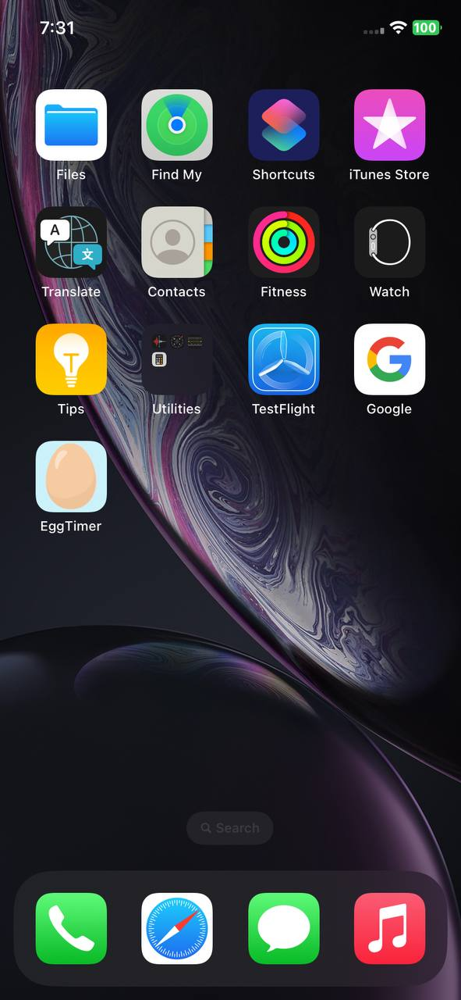

<h1 align="center">Egg Timer - iOS App</h1>

**Egg Timer** is a beautiful iOS app designed to help you boil your eggs to perfection! Whether you prefer soft, medium, or hard-boiled eggs, this app will assist you in timing the cooking process based on your preferences. No more guessing, just perfectly boiled eggs every time!

## Features :

- **Perfectly Timed Eggs**: Choose your preferred egg firmness (soft, medium, or hard) and the app will show you the exact time to boil your eggs.
- **Interactive Timer**: Simple and easy-to-use timer with a smooth countdown experience.
- **Elegant Design**: Clean and visually appealing interface, making egg boiling an enjoyable task.

## Installation :

To run this project locally:

1. Clone the repository:
    ```bash
    git clone https://github.com/deepanshubajaj/EggTimer-iOSApp.git
    ```

2. Open the project in Xcode:
    ```bash
    open EggTimer.xcodeproj
    ```

3. Build and run the app on a simulator or physical device.

> Make sure you have Xcode installed and configured properly to run the project.

## App Look :

<p align="center">
  
</p>
<p align="center">
  *App snapshot in the simulator.*
</p>

## Screenshots :

<p align="center">
  
</p>
<p align="center">
  *Splash screen displayed upon app launch.*
</p>

<p align="center">
  
</p>
<p align="center">
  *Screenshot of the Egg Timer app showing the main screen with firmness required.*
</p>

## App Icon :

<p align="center">
  
</p>
<p align="center">
  *The app icon reflects the theme of boiling eggs to perfection.*
</p>

## Video Demo :

Here’s a short video showcasing the app's functionality:

<p align="center">
  
</p>

[Watch Working Video](ProjectOutputs/WorkingVideo/workingVideo.MP4)
